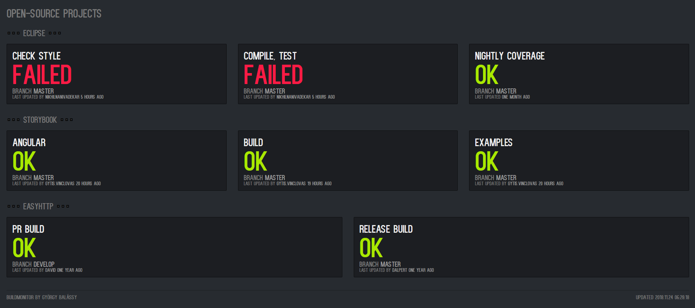

# Build Monitor Dashboard

> Dashboard to display the status of your builds from your build server (e.g. TeamCity).

**NOTE:** This is a work in progress, breaking changes may come at any time!

## Screenshot

## Features

The dashboard is optimized to display the results of multiple build configurations with the following features:

- Multiple dashboards with unique URLs
- Build configuration name
- Default branch or a pre-selected branch
- The name of the user with the last change on the branch
- Automatic refresh with a 15 seconds interval
- Groups (shown as "Eclipse", "Storybook" and "EasyHTTP" in the screenshot above) 

## Technology highlights

- **ASP.NET Core 2.1** backend targeting the full .NET Framework (required by a referenced 3rd-party component).
  - **Dependency injection** for clear dependencies and testability + **unit tests**.
    - Random **test data generation** with [Bogus](https://github.com/bchavez/Bogus).
  - **Static code analysis** with Microsoft Code Analysis (aka. FxCop).
  - Enforced **coding standards** with [StyleCop](https://github.com/StyleCop/StyleCop).
  - Configuration read from **environment variables** and JSON. (Read more: [The Twelve-Factor App: III. Config](https://12factor.net/config))
    - Automatic **configuration reloading** with the [Options pattern](https://docs.microsoft.com/en-us/aspnet/core/fundamentals/configuration/options?view=aspnetcore-2.1).
    - Configuration value **validation** with data annotations.
  - All assemblies are **strong-named**.
    - **Signing third-party open-source assemblies** with [StrongNamer](https://github.com/dsplaisted/strongnamer).
  - Enforcing **HTTPS and [HSTS](https://en.wikipedia.org/wiki/HTTP_Strict_Transport_Security)** by default.
  - **Moment-like date formatting** with [Humanizer](https://github.com/Humanizr/Humanizer).
  - Accessing the **TeamCity REST API** with [TeamCitySharp](https://github.com/mavezeau/TeamCitySharp).
    - **Caching** API responses **in-memory** with [IMemoryCache](https://docs.microsoft.com/en-us/aspnet/core/performance/caching/memory?view=aspnetcore-2.1) + fixing the [multiple factory call issue](https://tpodolak.com/blog/2017/12/13/asp-net-core-memorycache-getorcreate-calls-factory-method-multiple-times/) tested with unit test.
- **Angular 6** Single Page Application frontend implemented in **TypeScript**.
  - **Server-side** rendering.
  - **Static code analysis** with [TSLint](https://palantir.github.io/tslint/).
  - Customized **[Angular Material](https://material.angular.io/)** design implemented in [SCSS](http://sass-lang.com/), with the layout based on [cards](https://material.angular.io/components/card/overview).
  - Polling the backend with [RxJS Observables](http://reactivex.io/rxjs/class/es6/Observable.js~Observable.html).
  - Enforced coding standards with `.editorconfig`.
  - Human-friendly date formatting with [Moment](https://momentjs.com/) pipe.
- **Continuous Integration (CI)** with Azure DevOps.
  - Build pipeline implemented in `azure-pipelines.yml`.
    - Build includes both backend and frontend unit tests.
    - Build includes static code analysis.
  - Release pipeline to **Azure AppService**.

## Architecture

This solution follows the **Clean Architecture** recommended for ASP.NET Core applications. Read more:

- [Steve Smith: Architect Modern Web Applications with ASP.NET Core and Azure - free eBook](https://docs.microsoft.com/en-us/dotnet/standard/modern-web-apps-azure-architecture/)
- [Jason Taylor: Clean Architecture with ASP.NET Core 2.1 - conference presentation](https://www.youtube.com/watch?v=_lwCVE_XgqI)

The **Domain Layer** contains all entities, enums, exceptions, types and logic specific to the domain.

The **Application Layer** contains all application logic. It is dependent on the Domain layer, but has no dependencies on any other layer or project. This layer defines interfaces that are implemented by outside layers. For example the `IBuildService` interface is defined in the Application layer and imlemented by the `TeamCityBuildService` in the Infrastructure layer.

The **Persistence Layer** contains all implementation required to load and store the data for the application, including the configuration.

The **Infrastructure Layer** contains classes for accessing external resources such as file systems, web services, SMTP, etc. These classes are implementing the interfaces defined within the Application layer.

The **Presentation Layer** contains all the user interface logic, in this case both the backend and the browser part.

The layers are implemented in separate projects to ensure correct separation of concerns and clear dependencies, even if this is a basic application and everything could be implemented in a single project, which would speed up the build process.

## Installation

Set the following **environment variables** to specify the connection to your build server:
- `BUILDMONITOR__HOST`, e.g. `server.example.com:8080`
- `BUILDMONITOR__USERNAME`, e.g. `myuser`
- `BUILDMONITOR__PASSWORD`, e.g. `mypassword`

## Got feedback?

Your feedback is more than welcome, please send your suggestions, feature requests or bug reports as [Github issues](https://github.com/balassy/BuildMonitor/issues).

## Contributing guidelines

Contributions of all kinds are welcome, please feel free to send Pull Requests. As they are requirements of successful build all code analyzers and tests MUST pass, and also please make sure you have a reasonable code coverage for new code.

Thanks for your help in making this project better!

## Acknowledgements

Thanks to [Jason Taylor](https://www.youtube.com/watch?v=_lwCVE_XgqI) for the Clean Architecture diagram.

## About the author

This project is created and maintaned by [György Balássy](https://linkedin.com/in/balassy).